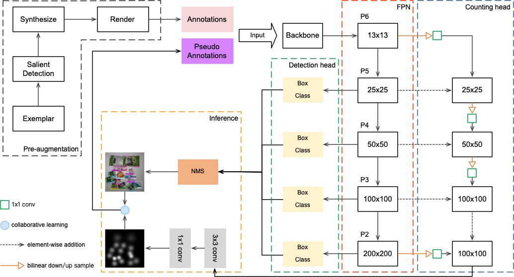

# Iterative Knowledge Distillation for Automatic Check-Out

Introduction
-----------------
Automatic Check-Out (ACO) provides an object detection based mechanism for retailers to process the purchases of customers automatically. However, it suffers a lot from the domain shift problem because of different data distribution between single item in training exemplar images and mixed items in testing checkout images. In this paper, we propose a new iterative knowledge distillation method to solve the domain adaptation problem for this task. First, we develop a new augmentation data strategy to generate synthesized checkout images. It can extract segmented items from the training images by the coarse-to-fine strategy and filter items with realistic poses by pose pruning. Second, we propose a dual pyramid scale network (DPSNet) to exploit multi-scale feature representation in joint detection and counting views. Third, the iterative training strategy is developed to make full use of both image-level and instance-level samples to learn common feature representation and narrow the gap between source domain and target domain. Extensive experiments on the large-scale Retail Product Checkout (RPC) dataset show the proposed DPSNet can achieve state-of-the-art performance compared with existing methods.



## Installation

Check [INSTALL.md](INSTALL.md) for installation instructions.

## Inference

Run inference with pre-trained models using this command. Then images with boxes, labels and scores will
be saved to `rpc_results` folder.

```bash
python demo/rpc_demo.py --config-file configs/e2e_faster_rcnn_R_101_FPN_1x_rpc_xxx.yaml --images_dir /path/to/test2019
```

## Prepare dataset

Using `toolboxes` to extract masks, train [Salient Object Detection](https://github.com/AceCoooool/DSS-pytorch)
and render with [CycleGAN](https://github.com/junyanz/pytorch-CycleGAN-and-pix2pix). Then modify `maskrcnn_benchmark/config/paths_catalog.py` 
to make the paths correct.

## Single GPU training

Most of the configuration files that we provide assume that we are running on 4 GPUs.
In order to be able to run it on fewer GPUs, there are a few possibilities:

**1. Run the following without modifications**

```bash
python tools/train_net.py --config-file "/path/to/config/file.yaml"
```
This should work out of the box and is very similar to what we should do for multi-GPU training.
But the drawback is that it will use much more GPU memory. The reason is that we set in the
configuration files a global batch size that is divided over the number of GPUs. So if we only
have a single GPU, this means that the batch size for that GPU will be 8x larger, which might lead
to out-of-memory errors.

If you have a lot of memory available, this is the easiest solution.

**2. Modify the cfg parameters**

If you experience out-of-memory errors, you can reduce the global batch size. But this means that
you'll also need to change the learning rate, the number of iterations and the learning rate schedule.

Here is an example for Mask R-CNN R-50 FPN with the 1x schedule:
```bash
python tools/train_net.py --config-file "configs/e2e_mask_rcnn_R_50_FPN_1x.yaml" SOLVER.IMS_PER_BATCH 2 SOLVER.BASE_LR 0.0025 SOLVER.MAX_ITER 720000 SOLVER.STEPS "(480000, 640000)" TEST.IMS_PER_BATCH 1
```
This follows the [scheduling rules from Detectron.](https://github.com/facebookresearch/Detectron/blob/master/configs/getting_started/tutorial_1gpu_e2e_faster_rcnn_R-50-FPN.yaml#L14-L30)
Note that we have multiplied the number of iterations by 8x (as well as the learning rate schedules),
and we have divided the learning rate by 8x.

We also changed the batch size during testing, but that is generally not necessary because testing
requires much less memory than training.


## Multi-GPU training
We use internally `torch.distributed.launch` in order to launch
multi-gpu training. This utility function from PyTorch spawns as many
Python processes as the number of GPUs we want to use, and each Python
process will only use a single GPU.

```bash
export NGPUS=4
python -m torch.distributed.launch --nproc_per_node=$NGPUS tools/train_net.py --config-file "path/to/config/file.yaml"
```
## Results

|    level |      method        |   cAcc |  mCIoU |  ACD | mCCD |  mAP50 |   mmAP |
|     ---: |               ---: |   ---: |   ---: | ---: | ---: |   ---: |   ---: |
| averaged | Render+IS (DPSNet) | 88.14% | 98.66%    | 0.17 | 0.01 | 98.64% | 98.64% |

## Citations
Please consider citing this project in your publications if it helps your research. The following is a BibTeX reference. The BibTeX entry requires the `url` LaTeX package.
```
TODO
```